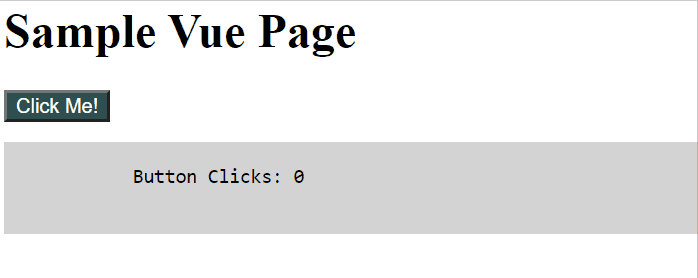

 

# AEM Vue Core Components

A repository containing core Vue.js components for AEM without the need for a complete SPA setup.

## Motivation

With so many ways to create Single Page Applications (SPAs) you may wonder, why the need to create this repository? The reasons for this approach and the motivation to create the current repository include:

1. Wanting to create a simple component framework to add SPA capabilities to existing AEM pages
2. Wanting to avoid the need for a complex and potentially over-engineered `ui.frontend` SPA application
3. Continuing to leverage core AEM features such as [clientlibs](https://experienceleague.adobe.com/docs/experience-manager-65/developing/introduction/clientlibs.html?lang=en), [HTL](https://experienceleague.adobe.com/docs/experience-manager-htl/using/getting-started/getting-started.html?lang=en), and component [overlays](https://experienceleague.adobe.com/docs/experience-manager-65/developing/platform/overlays.html?lang=en).
4. Combining portions of the Vue.js [Single File Component (SFC)](https://v3.vuejs.org/guide/single-file-component.html) concepts with [AEM component](https://experienceleague.adobe.com/docs/experience-manager-65/developing/components/developing-components.html?lang=en) concepts
5. Leveraging Vue.js client [template](https://v3.vuejs.org/guide/template-syntax.html) capabilities 

## Sample Usage

1. Add the `ui.apps` module to your current application by building this project yourself, or visit the [Adding as a Dependency](#adding-as-a-dependency) section to retrieve the package via Github Packages.
2. Create your own application container by extending the Vue Container component. See [sample](https://github.com/GuillaumeCleme/aem-vue-corecomponents/tree/master/ui.samples/src/main/content/jcr_root/apps/vuecore-samples/components/sampleapp).
3. Create your own components by extending the Vue Component component. See [sample](https://github.com/GuillaumeCleme/aem-vue-corecomponents/tree/master/ui.samples/src/main/content/jcr_root/apps/vuecore-samples/components/samplebutton).
4. Add your container and components to any AEM Page and continue benefiting from default AEM features.



### Adding as a Dependency
This project uses [GitHub Packages](https://github.com/features/packages) to publish it's artifacts publicly via GitHub. To add this package as a dependency to your own Maven project, see the [Authenticating to GitHub Packages](https://help.github.com/en/packages/using-github-packages-with-your-projects-ecosystem/configuring-apache-maven-for-use-with-github-packages#authenticating-to-github-packages) documentation from GitHub and add the Maven dependency to your project:

```
<dependency>
  <groupId>me.guillaumecle.aem</groupId>
  <artifactId>vuecore.ui.apps</artifactId>
  <version>1.0.0</version>
</dependency>
```
## Modules

The main parts of the template are:

* ui.apps: contains the /apps (and /etc) parts of the project, ie JS&CSS clientlibs, components, and templates
* ui.samples: contains sample content using the components from the ui.apps
* ui.frontend: an optional dedicated front-end build mechanism (Webpack project)
* ui.tests: Selenium based UI tests
* all: a single content package that embeds all of the compiled modules (bundles and content packages) including any vendor dependencies

## How to build

To build all the modules run in the project root directory the following command with Maven 3:

    mvn clean install

To build all the modules and deploy the `all` package to a local instance of AEM, run in the project root directory the following command:

    mvn clean install -PautoInstallSinglePackage

Or to deploy it to a publish instance, run

    mvn clean install -PautoInstallSinglePackagePublish

Or alternatively

    mvn clean install -PautoInstallSinglePackage -Daem.port=4503

Or to deploy only a single content package, run in the sub-module directory (i.e `ui.apps`)

    mvn clean install -PautoInstallPackage

### Testing

These tests will run against the UI layer of your AEM application using Selenium technology. 

To run them locally:

    mvn clean verify -Pui-tests-local-execution

This default command requires:
* an AEM author instance available at http://localhost:4502 (with the whole project built and deployed on it, see `How to build` section above)
* Chrome browser installed at default location

Check README file in `ui.tests` module for more details.

### ClientLibs

The frontend module is made available using an [AEM ClientLib](https://helpx.adobe.com/experience-manager/6-5/sites/developing/using/clientlibs.html). When executing the NPM build script, the app is built and the [`aem-clientlib-generator`](https://github.com/wcm-io-frontend/aem-clientlib-generator) package takes the resulting build output and transforms it into such a ClientLib.

A ClientLib will consist of the following files and directories:

- `css/`: CSS files which can be requested in the HTML
- `css.txt` (tells AEM the order and names of files in `css/` so they can be merged)
- `js/`: JavaScript files which can be requested in the HTML
- `js.txt` (tells AEM the order and names of files in `js/` so they can be merged
- `resources/`: Source maps, non-entrypoint code chunks (resulting from code splitting), static assets (e.g. icons), etc.

### Maven settings

The project comes with the auto-public repository configured. To setup the repository in your Maven settings, refer to:

    http://helpx.adobe.com/experience-manager/kb/SetUpTheAdobeMavenRepository.html

## Contributors
* [Guillaume Clement](https://guillaumecle.me/)

## License
Apache License 2.0   
